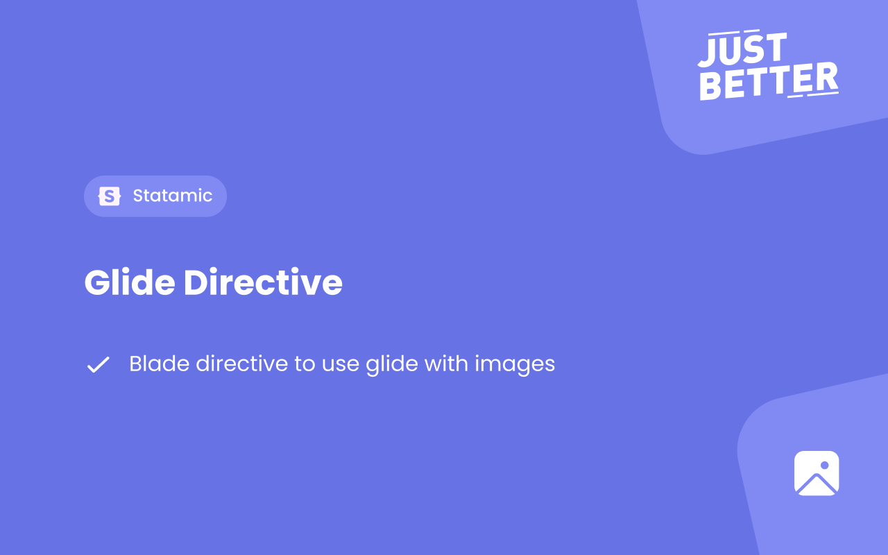

<a href="https://github.com/justbetter/statamic-glide-directive" title="JustBetter">
    
</a>

# Statamic glide directive

> Blade directive to use glide with images

## How to Install

You can search for this addon in the `Tools > Addons` section of the Statamic control panel and click **install**, or run the following command from your project root:

``` bash
composer require justbetter/statamic-glide-directive
```

## Usage
This package adds a blade directive. You can put a Asset in the blade directive and it will render the image for you defined by the presets in config. A example of the directive with all the options is listed below.
```php
@responsive($image, [
    'alt' => 'This is an alt text.', 
    'class' => 'some classes here',
    'loading' => 'lazy'
])
```

To allow the images to change on resize, add this include to your head in the layouts:
```php
@include('statamic-glide-directive::partials.head')
```

We recommend to generate your presets by using `php please assets:generate-presets`.

To combat performance issues we recommend using redis for your queue connection, if you keep this on sync the images will be generated on the fly impacting page load.

When using redis the images will also be made on the fly, while working the jobs on the queue. If an image doesn't have a glide preset ready we will use the original image url for the first page load.


## Config

The package has some default config. By default it will use the presets defined in the config of this addon. If you've defined you're asset presets in the Statamic config, that will be used.

Default config:
```php
'presets' => [
    'placeholder' => ['w' => 32, 'h' => 32, 'q' => 100, 'fit' => 'crop_focal'],
    'xs' => ['w' => 320, 'h' => 320, 'q' => 100, 'fit' => 'crop_focal'],
    'sm' => ['w' => 480, 'h' => 480, 'q' => 100, 'fit' => 'crop_focal'],
    'md' => ['w' => 768, 'h' => 768, 'q' => 100, 'fit' => 'crop_focal'],
    'lg' => ['w' => 1280, 'h' => 1280, 'q' => 100, 'fit' => 'crop_focal'],
    'xl' => ['w' => 1440, 'h' => 1440, 'q' => 100, 'fit' => 'crop_focal'],
    '2xl' => ['w' => 1680, 'h' => 1680, 'q' => 100, 'fit' => 'crop_focal'],
],
```

### Placeholder
On pageload a small variant of the image will be loaded, if you don't want this you can disable the placeholder in the config file.
```php
'placeholder' => true,
```

### Sources
Configure which sources you would like to use. By default we only use webp sources, it's also possible to only configure sources based on the image mime type or you can make use of both.
```php
'sources' => 'webp',
```

### Publish
```
php artisan vendor:publish --provider="JustBetter\ImageOptimize\ServiceProvider"
```
